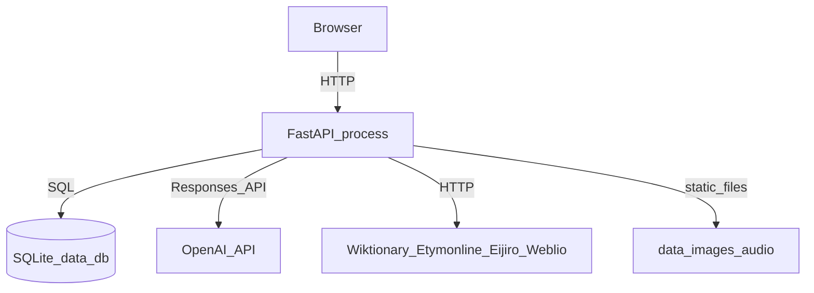

# 00. 概要

## アプリの目的

**English-net-dict** は、英単語を語源から理解するための個人用辞書アプリである。単なる意味の暗記ではなく、単語のパーツ（語源コンポーネント）や派生関係を可視化し、AIを使って学習を補助する。

- **単語辞書**：意味・例文・活用形・発音音声を、Wiktionary/Etymonline/Eijiro/Weblioのスクレイピングと GPT による構造化を組み合わせて自動生成する。
- **語源マップ**：単語を構成する語源要素（接頭辞・接尾辞・語根など）に分解し、言語間の伝播チェーン（例：ラテン語→古フランス語→英語）を可視化する。
- **AI画像生成**：単語・熟語・グループごとに、意味や語源イメージを表現するインフォグラフィック画像をオンデマンドで生成する。
- **派生語・関連語**：ある単語から派生した語や、同義語・対義語・紛らわしい語などの関連語を管理する。
- **単語専用チャットボット**：各単語・語源要素・熟語・グループごとに、function-callingツールを備えたAIチャットで質問できる。
- **熟語（フレーズ）**：単語をまたぐイディオムや慣用句を、構成語にリンクした形で管理する。
- **グループ（コレクション）**：任意の単語・熟語・例文をまとめて学習セットを作れる。AIによる候補提案にも対応する。
- **リスニング練習**：TOEIC形式のAI生成台本を6種類のTTSペルソナで読み上げ、聞く→ディクテーション→音読→追っかけ→シャドーイングの5ステップで練習し、誤答傾向（弱点）を分析して次の台本生成にフィードバックする。

## 技術スタック一覧

| レイヤー | 技術 | 配置場所 |
|---|---|---|
| バックエンドAPI | FastAPI（Python） | `backend/server/` |
| バックエンドロジック | Python（サービス層・SQLAlchemyモデル） | `backend/core/` |
| DB | SQLite（`data/db/data.db`） | SQLAlchemy ORM、Alembicでスキーマ管理 |
| マイグレーション | Alembic | `backend/alembic/` |
| フロントエンド | React + TypeScript + Vite | `frontend/src/` |
| ルーティング | React Router | `frontend/src/App.tsx` |
| データフェッチ | TanStack Query（React Query） | `frontend/src/main.tsx` |
| HTTPクライアント | axios | `frontend/src/lib/api.ts` |
| LLM/画像/音声 | OpenAI API（Responses API, gpt-image-1, tts-1, whisper-1） | `backend/core/services/gpt_service*.py` 等 |
| 運用CLI | 独自の `database_build` パッケージ（argparse） | `backend/database_build/` |
| パッケージ管理 | uv（backend）、npm（frontend） | ルートの `setup.*`/`start.*` |

## ディレクトリマップ

```
English-net-dict/
  backend/
    server/            FastAPIアプリ本体・ルーター（HTTP層）
      main.py            アプリ生成・CORS・静的ファイル配信・起動時マイグレーション
      routers/           10個のルーターファイル（words, chat, groups, images, audio,
                          listening, phrases, search, etymology_components, migration）
    core/              ドメインロジック層
      config.py          設定（Settings、環境変数）
      models.py          SQLAlchemyモデル（全30テーブル）
      schemas.py         Pydanticスキーマ（API入出力の型）
      constants.py       グループ名長さ上限など定数
      personas.py        リスニング用TTSペルソナ定義
      services/          26個のサービスファイル（スクレイピング・GPT・画像・音声・
                          リスニング・チャット等のビジネスロジック）
      services/scraper/  Wiktionary/Etymonline/Eijiro/Weblio スクレイパー（7ファイル）
      prompts/           GPTに渡すプロンプトテンプレート（14ファイル、*.md）
      migrations/        起動時マイグレーション実行ラッパー（Alembic呼び出し）
      utils/             テキスト処理・語源コンポーネント整形などの補助関数
      stores/            低レベルなDBアクセスヘルパー
    alembic/           Alembicマイグレーションリビジョン（001〜009）
    database_build/    運用CLI（`python -m database_build ...`）
    tests/             pytestテスト
  frontend/
    src/
      pages/             画面単位のコンテナコンポーネント
      components/        再利用可能なUIコンポーネント（atom/ と機能別フォルダを含む）
      lib/               APIクライアント・共通フック・定数
      types/             ドメイン型定義（index.ts）
  data/                実行時データ（DB本体・生成画像・生成音声・NLTKキャッシュ等）
  docs/                旧仕様書（現状かなり古い。上記参照）
  design_doc/          本ドキュメント群
  config.yaml          backend/frontend共有の非機密設定
  setup.*, start.*     セットアップ・起動スクリプト（sh/ps1/bat）
```

## 用語集

| 用語 | 意味 |
|---|---|
| lemma（レンマ） | 活用前の見出し語形。例：`go` は `goes`/`went`/`going`/`gone` のlemma |
| inflection（活用形） | lemmaから変化した語形。`words.lemma_word_id` で元のlemma語にリンクされる |
| etymology component（語源コンポーネント） | 単語を構成する語源的パーツ（接頭辞・接尾辞・語根など）。単語に依存しない独立キャッシュとして `etymology_components` テーブルに保持される |
| persona（ペルソナ） | リスニング機能で使う、OpenAI TTSの音声IDに紐づいた架空の話者設定（6種固定） |
| phrase（熟語） vs word（単語） | 入力が2語以上の空白区切りであれば phrase として扱われ、`words` ではなく `phrases` テーブルに保存される |
| weak word / weak phrase（弱点語・弱点フレーズ） | リスニング練習のディクテーション・音読で繰り返し間違えている単語・フレーズ。集計されて次の台本生成に反映される |
| SAVEPOINT-per-tool | チャットのfunction-callingツール（DB書き込みを伴うもの）を、チャット全体のトランザクションとは別のSQL SAVEPOINT内で実行するパターン。1つのツール呼び出し失敗がチャットターン全体を巻き込まないようにする |
| 公式画像 vs チャット内画像 | 単語/熟語/グループに永続的に紐づく「公式画像」（`WordImage`等、`is_active`でソフト履歴管理）と、チャット内でその場限りに生成される「チャット内画像」（DBに永続化されず、チャットメッセージのMarkdown内に埋め込まれるのみ）は別の仕組み |

## システム全体図



## 各ドキュメントへのポインタ

| 知りたいこと | 見るファイル |
|---|---|
| バックエンドがどう動いているか（実行モード・設定・キャッシュ） | `backend/01_architecture.md` |
| DBのテーブル定義 | `backend/02_database.md` |
| エンドポイント一覧 | `backend/03_api.md` |
| どのサービス/プロンプトが何をするか | `backend/04_services.md` |
| CLIの使い方 | `backend/05_cli.md` |
| フロントエンドのルーティング・APIクライアント | `frontend/01_architecture.md` |
| どのコンポーネントが何をするか | `frontend/02_components.md` |
| 単語登録の仕組み、語源、熟語、グループ、リスニング、チャット、画像生成、活用形統合の**動作の流れ** | `features/` 配下の該当ファイル |
