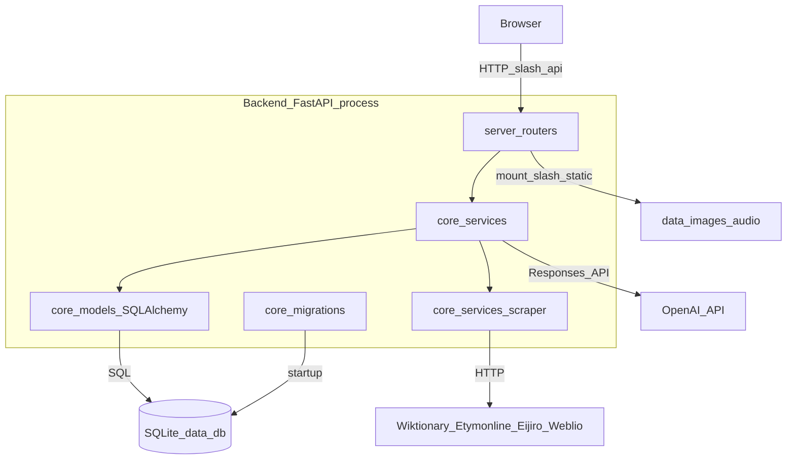

# Backend 01. アーキテクチャ

前提：`00_overview.md` を読んでいること。

## システム構成図



`server/main.py` の `create_app()` が単一の `FastAPI` インスタンスを構築する。ルーター（`server/routers/*.py`）は HTTP 入出力とバリデーションのみを担当し、実際のドメインロジックは `core/services/*.py` に委譲する。サービス層は SQLAlchemy モデル（`core/models.py`）を通じて SQLite に読み書きし、外部連携（スクレイピング・LLM呼び出し）を行う。

## ルーターのマウント構成

| ルーターファイル | URLプレフィックス |
|---|---|
| `words.py` | `/api/words` |
| `etymology_components.py` | `/api/etymology-components` |
| `images.py` | `/api` |
| `audio.py` | `/api` |
| `chat.py` | `/api` |
| `listening.py` | `/api/listening` |
| `groups.py` | `/api/groups` |
| `phrases.py` | `/api` |
| `search.py` | `/api/search` |
| `migration.py` | `/api/migration` |

エンドポイントの詳細は `03_api.md` を参照。

その他のエンドポイント：`GET /health`（死活監視用、`{"ok": true}` を返す）。

## 実行モード

アプリには2つの動かし方があり、CORS設定とフロントエンド配信の方法が異なる。

| モード | 起動方法 | フロントエンド配信 | オリジン構成 |
|---|---|---|---|
| 開発モード | `cd backend && uv run uvicorn server.main:app --reload --port 8000` と `cd frontend && npm run dev`（vite dev server、port 5190固定 in `vite.config.ts`）を別々に起動 | Viteのdevサーバーがホット・リロード付きで配信 | フロント(5190) → バックエンド(8000) へCORS越しにHTTPコール |
| `start` モード（`start.sh`/`start.ps1`/`start.bat`） | `setup.*` で `npm run build` 済みの `frontend/dist` を、`vite preview`（port 5173）で配信しつつバックエンドを起動 | `vite preview` が配信、またはFastAPI自身が `frontend/dist` をSPAフォールバックとして配信可能（`server/main.py` の `spa_fallback`） | 5173/5190どちらも `settings.cors_origins` に許可済み |

`server/main.py` は `frontend/dist` が存在する場合、`/assets` に `frontend/dist/assets` をマウントし、それ以外の未知パスへの `GET` リクエストは全て `index.html` にフォールバックする（`spa_fallback`、パストラバーサル対策として `relative_to` でディレクトリ外アクセスを拒否）。これにより、FastAPIプロセス単体でビルド済みフロントエンドとAPIの両方を1オリジンから配信することもできる。

## 設定と環境変数

設定は2つのソースから読み込まれる（`core/config.py`）。

**`backend/.env`（`Settings` クラス、pydantic-settings）**

| 設定 | デフォルト値 | 用途 |
|---|---|---|
| `app_name` | `English Etymology Dictionary API` | FastAPIのタイトル |
| `app_env` | `development` | 環境フラグ |
| `openai_api_key` | `""` | 空の場合、GPT/画像/TTS/Whisperの全機能が無効化され、ルールベースのフォールバックに切り替わる |
| `openai_model_structured` | `gpt-4o-mini` | 単語構造化・語源補完・リスニング台本生成・フィードバック生成など、構造化JSON生成全般 |
| `openai_model_chat` | `gpt-4o-mini` | チャット機能（単語/語源要素/グループ/熟語チャット） |
| `openai_image_model` | `gpt-image-1` | 単語/熟語/グループの画像生成 |
| `openai_image_size` | `1024x1536` | 生成画像のサイズ |
| `openai_tts_model` | `tts-1` | 単語/例文/熟語音声、リスニング台本の行音声 |
| `openai_tts_voice` | `alloy` | デフォルト音声 |
| `openai_transcribe_model` | `whisper-1` | 音読採点時の文字起こし |
| `data_dir` | `<repo>/data` | 実行時データのルート |
| `database_url` | `sqlite:///<data_dir>/db/data.db` | SQLAlchemy接続文字列 |
| `image_dir` | `<data_dir>/images` | 生成画像の保存先 |
| `audio_dir` | `<data_dir>/audio` | 生成音声の保存先 |
| `cors_origins` | `localhost`/`127.0.0.1` の `5173`・`5190` | 許可するフロントエンドオリジン |
| `nltk_data_dir` | `<data_dir>/nltk_data` | NLTK WordNetコーパスのキャッシュ先 |

`core/services/scraper/wiktionary.py` は上記に加え、`os.getenv` で直接 `EN_DICT_WIKTIONARY_PARALLEL_LOCALES` を読む（デフォルトtrue、英語版・日本語版Wiktionaryを並列取得するか逐次取得するかを切り替える）。

**ルート直下の `config.yaml`（backend・frontend共有、非機密設定）**

```yaml
group_name_max_length: 50
api_base_url_default: "http://localhost:8000"
```

`core/config.py` の `_load_shared_config()` がこれを読み込み、`core/constants.py` 経由でバックエンド側の定数として使う。フロントエンド側は同じ値を `vite-plugin-config.ts` が Vite の `define`（`__SHARED_GROUP_NAME_MAX_LENGTH__`／`__SHARED_API_BASE_URL_DEFAULT__`）としてビルド時に注入し、`frontend/src/lib/sharedConfig.ts` がそれを再エクスポートする。これにより、グループ名の文字数上限やAPIベースURLのデフォルト値をbackend/frontendの2箇所に別々に書かずに済む（詳細は `frontend/01_architecture.md`）。

**フロントエンド `.env`（Vite）**

| 変数 | 用途 |
|---|---|
| `VITE_API_BASE_URL` | バックエンドAPIのベースURL（未設定時は `config.yaml` の `api_base_url_default` にフォールバック） |
| `VITE_BULK_CHUNK_SIZE` | 単語一括登録時のチャンクサイズ（デフォルト5） |

## マイグレーション機構

起動時に `server/main.py` の `@app.on_event("startup")` から `core/migrations/alembic_runner.py: run_alembic_migrations()` が無条件に呼ばれ、Alembic設定（`backend/alembic.ini`）を読み込んで、DBが既に最新リビジョンならスキップし、そうでなければ `alembic.command.upgrade(config, "head")` をプロセス内で実行する。つまり、手動で `alembic upgrade` を叩く必要はなく、サーバー起動のたびに自動でスキーマが最新化される。

`core/migrations/runtime_sqlite.py` という、`PRAGMA table_info`/`ALTER TABLE` を手書きしたレガシーなマイグレーション関数も存在するが、**現在どこからも呼び出されていないデッドコード**である（`core/migrations/__init__.py` がエクスポートしているのは `run_alembic_migrations` のみ）。Alembicへの移行前に使われていたと見られる。詳細なリビジョン履歴は `02_database.md` を参照。

## 横断的パターン

### キャッシュ層

| キャッシュ | 保存場所 | 何をキャッシュするか | 主な利用元 |
|---|---|---|---|
| Wiktionaryスクレイプキャッシュ | `data/scrape_cache/<word>.json`（ファイル）＋プロセス内メモリ | Wiktionaryの英語版・日本語版パース結果 | `core/services/scraper/wiktionary.py`（同じ単語の再取り込みでネットワークアクセスをスキップ） |
| バッチ内payload/meaningキャッシュ | プロセス内dict（1回の取り込みリクエスト内のみ有効、永続化されない） | 構造化済み単語JSON（`payload_cache`）、日本語一行訳（`meaning_cache`/`phrase_cache`） | `word_ingest_service.py`（同じバッチ内で同じ単語を二重に構築しない） |
| 例文キャッシュ | `data/cache/example_cache.db`（SQLite） | GPT生成の例文（プロンプト+モデル+入力のSHA256キー） | `gpt_service.py` の例文生成 |
| Embeddingキャッシュ | `data/cache/embedding_cache.db`（SQLite） | OpenAI embeddingベクトル | `embedding_service.py`（`definition_cluster_service.py` の意味クラスタリングで使用） |
| ペルソナサンプル音声 | `data/audio/persona-sample-<voice>.mp3`（UUIDなし固定名） | リスニングのペルソナ選択UIで再生する音声サンプル | `tts_service.get_or_create_persona_sample` |

### GPT呼び出しの同期/非同期並列パターン

単語登録の構造化呼び出しには同期版（`gpt_service.py`）と非同期並列版（`gpt_service_parallel.py`）の2系統があり、`gpt_service_parallel.py` は `openai.AsyncOpenAI` を使って真の非同期I/Oを行う。例文生成には3モード（`sequential`/`parallel_thread`/`parallel_async`）があり、デフォルトは `parallel_async`。詳細は `backend/04_services.md` と `features/01_word.md` を参照。

### チャットツールのSAVEPOINTパターン

チャットのfunction-callingツールのうちDBに書き込みを行うもの（`register_related_word` など）は、チャット全体のDBトランザクションとは別の SQL SAVEPOINT（`db.begin_nested()`）内で実行される。ツール呼び出しが失敗しても、既にflush済みのユーザーメッセージや、それ以前のツール呼び出し結果を巻き込んでロールバックしない。詳細は `features/06_chat.md` を参照。
