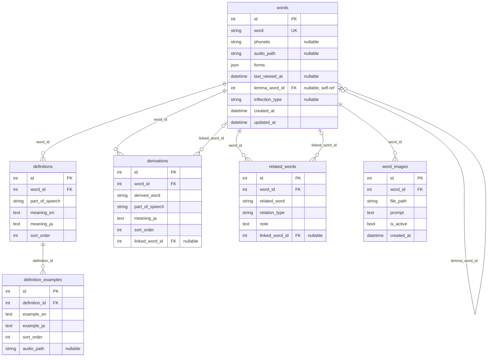
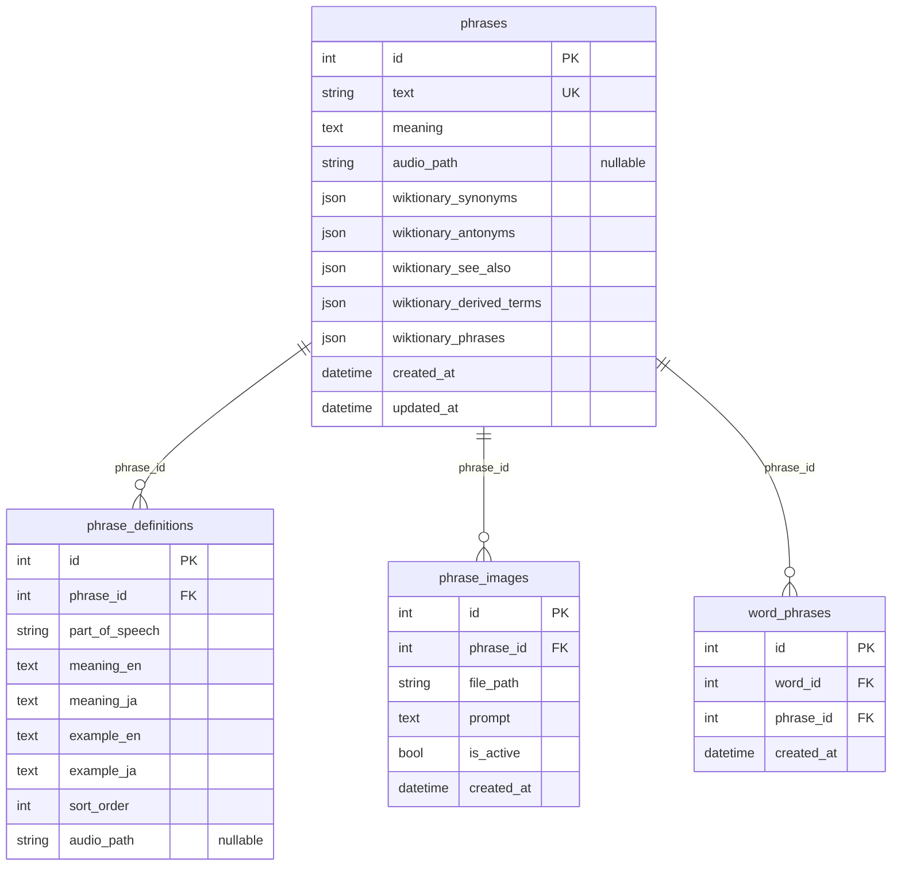
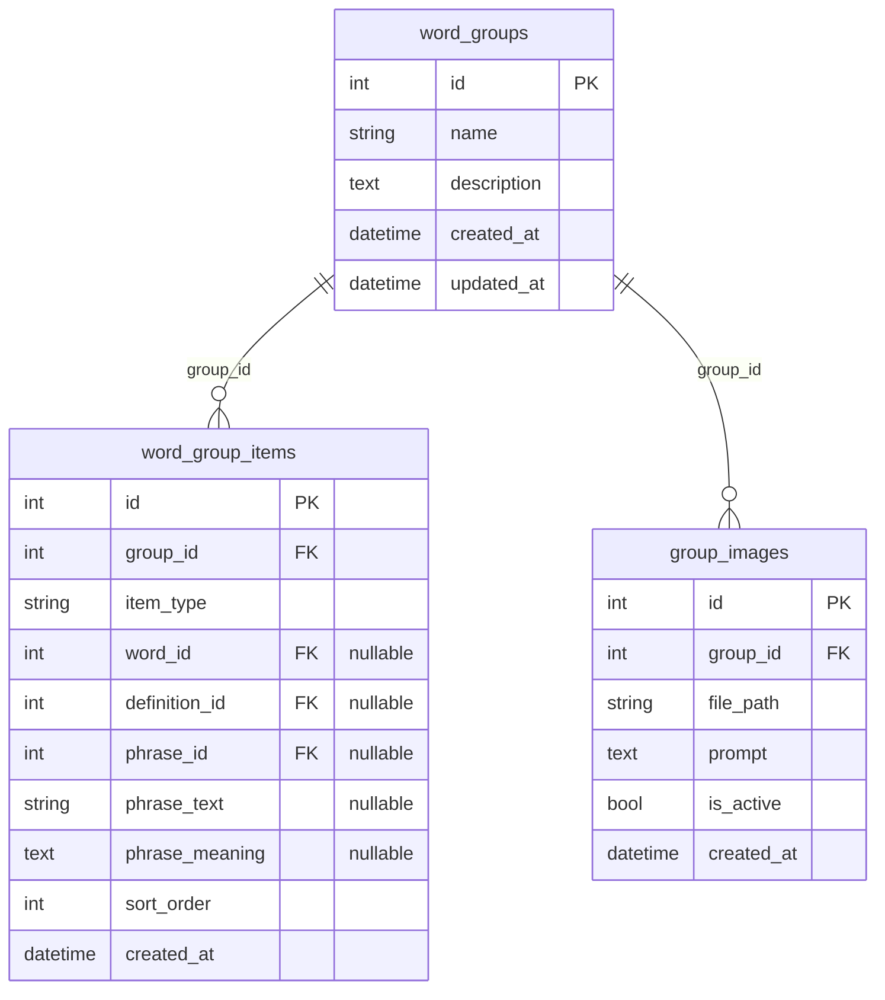
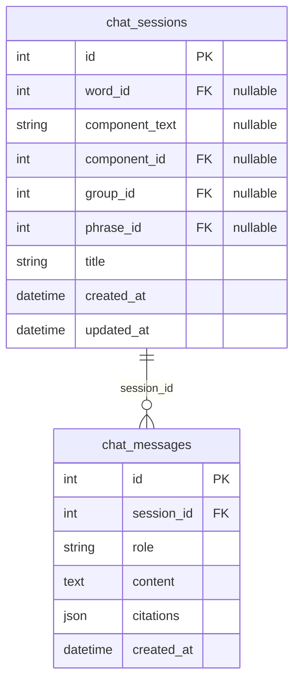
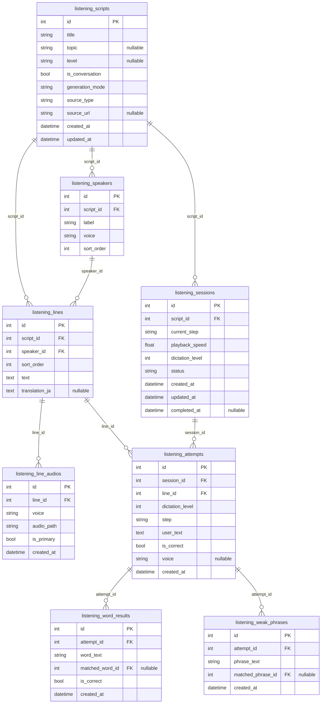

# Backend 02. データベース

前提：`00_overview.md`、`01_architecture.md` を読んでいること。ORMは SQLAlchemy（`backend/core/models.py`）、DBはSQLite（`data/db/data.db`）。全30テーブルを6つのドメインクラスタに分けて記載する。

## ER図の読み方

各クラスタごとに小さな `erDiagram` を用意し、30テーブルを1枚の図に詰め込むことはしない（可読性のため）。クラスタをまたぐ関連（例：`word_group_items.phrase_id` → `phrases.id`）は該当クラスタ両方の説明文中に記載する。列名の後ろの `nullable` はNULL許容、`UK` はUNIQUE制約、`FK` は外部キーを表す。

---

## クラスタ1: 単語コア

対象：`words` / `definitions` / `definition_examples` / `derivations` / `related_words` / `word_images`



### テーブルリファレンス

- **`words`**：単語本体。`word` は大文字小文字を区別しない一意キー（アプリ側で小文字化して保存）。`forms`（JSON）は活用情報を保持（後述）。`lemma_word_id`／`inflection_type` は活用形統合機能用（`features/08_inflection_lemma_merge.md`）。`audio_path` は発音音声。削除は関連する `definitions`・`etymologies`・`derivations`・`related_words`・`word_images`・`chat_sessions` にCASCADEする。
- **`definitions`**：品詞ごとの定義。`example_en`/`example_ja` は持たず、例文は子テーブル `definition_examples` に分離されている（旧構成との差分、`004_definition_examples` で移行）。
- **`definition_examples`**：定義ごとの例文（複数可）。`audio_path` で例文単位の音声を持てる。
- **`derivations`**：派生語（例：`decide` → `decision`）。`linked_word_id` が非NULLなら、`words` テーブルに実体を持つ別の単語を指す（`ON DELETE SET NULL`）。
- **`related_words`**：同義語・対義語・類縁語・紛らわしい語。`relation_type` は `synonym`/`antonym`/`cognate`/`confusable` のいずれか。
- **`word_images`**：単語の公式画像。`is_active` で現在表示中の画像を1件に絞る（過去分は `is_active=false` として残る＝ソフト履歴、削除ではない）。詳細は `features/07_image_generation.md`。

### `words.forms`（JSON）の内部構造

活用情報を保持するJSONオブジェクト。キー例：`third_person_singular`（三単現）、`present_participle`（現在分詞）、`past_tense`（過去形）、`past_participle`（過去分詞）、`plural`（複数形）、`comparative`（比較級）、`superlative`（最上級）、`uncountable`（不可算フラグ、真偽値）。熟語情報はこのJSON内には持たず、正規化された `phrases`/`word_phrases` テーブルで管理する（クラスタ3参照）。

---

## クラスタ2: 語源

対象：`etymologies` / `etymology_branches` / `etymology_variants` / `etymology_language_chain_links` / `etymology_component_meanings` / `etymology_components` / `etymology_component_items`

```mermaid
erDiagram
    etymologies {
        int id PK
        int word_id FK UK
        string origin_word "nullable"
        string origin_language "nullable"
        text core_image "nullable"
        text raw_description "nullable"
    }
    etymology_branches {
        int id PK
        int etymology_id FK
        int sort_order
        string label
        string meaning_en "nullable"
        string meaning_ja "nullable"
    }
    etymology_variants {
        int id PK
        int etymology_id FK
        int sort_order
        string label "nullable"
        text excerpt "nullable"
    }
    etymology_language_chain_links {
        int id PK
        int etymology_id FK
        int variant_id FK "nullable"
        int sort_order
        string lang
        string lang_name "nullable"
        string word
        string relation "nullable"
    }
    etymology_component_meanings {
        int id PK
        int etymology_id FK
        int variant_id FK "nullable"
        int sort_order
        string component_text
        text meaning
    }
    etymology_component_items {
        int id PK
        int etymology_id FK
        int variant_id FK "nullable"
        int sort_order
        string component_text
        text meaning "nullable"
        string type
        int component_id FK "nullable"
    }
    etymology_components {
        int id PK
        string component_text UK
        string resolved_meaning "nullable"
        json wiktionary_meanings
        json wiktionary_related_terms
        json wiktionary_derived_terms
        text wiktionary_source_url "nullable"
        datetime created_at
        datetime updated_at
    }

    etymologies ||--o{ etymology_branches : "etymology_id"
    etymologies ||--o{ etymology_variants : "etymology_id"
    etymologies ||--o{ etymology_language_chain_links : "etymology_id_top_level"
    etymologies ||--o{ etymology_component_meanings : "etymology_id_top_level"
    etymologies ||--o{ etymology_component_items : "etymology_id_top_level"
    etymology_variants ||--o{ etymology_language_chain_links : "variant_id"
    etymology_variants ||--o{ etymology_component_meanings : "variant_id"
    etymology_variants ||--o{ etymology_component_items : "variant_id"
    etymology_components |o--o{ etymology_component_items : "component_id"
```

### テーブルリファレンス

- **`etymologies`**：1単語につき1件（`word_id` UNIQUE）。`core_image` はGPTが生成する「語源の核となるイメージ」の説明文、`raw_description` はWiktionaryから取得した生の語源記述。
- **`etymology_branches`**：語源の意味分岐（例：ある語根が複数の意味系統に分かれる場合の枝分かれ）。
- **`etymology_variants`**：Wiktionaryの「Etymology 1」「Etymology 2」のような複数語源候補。
- **`etymology_language_chain_links`**：語源の言語伝播チェーン（例：ラテン語→古フランス語→英語）。`variant_id` がNULLならトップレベル、非NULLならその `etymology_variants` 内のチェーン。
- **`etymology_component_meanings`** / **`etymology_component_items`**：単語を構成する語源パーツとその意味。`etymology_component_items.type` はパーツの種類（接頭辞/接尾辞/語根など）、`component_id` が非NULLなら `etymology_components`（単語非依存のキャッシュ）にリンクする。
- **`etymology_components`**：語源コンポーネント自体のキャッシュ。特定の単語に紐づかず、コンポーネントのテキスト（例：`"tele-"`）をキーに、そのコンポーネント自身のWiktionaryページから取得した意味・関連語・派生語を保持する。詳細は `features/03_etymology.md`。

---

## クラスタ3: 熟語

対象：`phrases` / `phrase_definitions` / `word_phrases` / `phrase_images`



（`word_phrases.word_id` はクラスタ1の `words.id` を参照する。）

### テーブルリファレンス

- **`phrases`**：熟語・慣用句本体。`text` は正規化済みテキストで一意。`wiktionary_*` の5つのJSON配列列は、Wiktionaryからスクレイプした同義語・対義語・関連語・派生語・関連熟語のリスト。
- **`phrase_definitions`**：熟語の品詞別定義・例文（`definitions`/`definition_examples` の熟語版に相当するが、例文は分離せず同テーブルに持つ）。
- **`word_phrases`**：単語↔熟語の多対多中間テーブル。`(word_id, phrase_id)` に一意制約あり。並び順カラムはない。
- **`phrase_images`**：熟語の公式画像（`word_images` と同じ `is_active` ソフト履歴パターン）。

---

## クラスタ4: グループ

対象：`word_groups` / `word_group_items` / `group_images`



（`word_group_items.word_id`／`definition_id`／`phrase_id` はそれぞれクラスタ1・3のテーブルを参照する。）

### テーブルリファレンス

- **`word_groups`**：ユーザーが作る学習用コレクション。
- **`word_group_items`**：グループに登録された1アイテム。`item_type` が `word`/`definition`/`example`（1定義に紐づく例文）/`phrase` のいずれかを表す。`phrase_id` が設定されていればそれを優先して表示し、未設定時は `phrase_text`/`phrase_meaning`（レガシー表示用のフリーテキスト）にフォールバックする。
- **`group_images`**：グループの公式画像（同じ `is_active` パターン）。

---

## クラスタ5: チャット

対象：`chat_sessions` / `chat_messages`



### テーブルリファレンス

- **`chat_sessions`**：4つのスコープ（単語・語源コンポーネント・グループ・熟語）のいずれか1つに限定されるチャットセッション。CHECK制約（`ck_chat_sessions_scope`）で、`word_id`／(`component_text` or `component_id`)／`group_id`／`phrase_id` のうちちょうど1系統のみが非NULLであることを強制している。
- **`chat_messages`**：セッション内のメッセージ。`role` は `user`/`assistant`（ツール呼び出しの中間結果はDBに個別保存されず、`citations`（JSON）としてアシスタントメッセージに添付される）。詳細は `features/06_chat.md`。

---

## クラスタ6: リスニング

対象：`listening_scripts` / `listening_speakers` / `listening_lines` / `listening_line_audios` / `listening_sessions` / `listening_attempts` / `listening_word_results` / `listening_weak_phrases`



（`listening_word_results.matched_word_id` はクラスタ1の `words.id`、`listening_weak_phrases.matched_phrase_id` はクラスタ3の `phrases.id` を参照する。）

### テーブルリファレンス

- **`listening_scripts`**：1つの練習台本。`generation_mode`（`random`/`custom`/`weak_review` 相当）・`source_type`（`ai_generated`/`user_provided` 相当）で生成経路を区別する。
- **`listening_speakers`**：台本内の話者（`voice` はOpenAI TTSの音声ID＝ペルソナ）。
- **`listening_lines`**：台本の1行。長い文は文境界でチャンク分割されて格納される（25〜160文字目安）。
- **`listening_line_audios`**：1行に対する音声バリアント。同じ行を複数の声で生成でき、`is_primary` でデフォルト再生する音声を示す。
- **`listening_sessions`**：ユーザーの練習セッション。`current_step` は `listen`/`dictation`/`read_aloud`/`overlapping`（追っかけ）/`shadowing` のいずれか。
- **`listening_attempts`**：ディクテーション・音読の1試行。`step`/`dictation_level`/`voice` を記録し、`is_correct` は行単位の正誤。
- **`listening_word_results`**：ディクテーション試行を単語単位に分解した正誤記録。`matched_word_id` は辞書内の該当単語（あれば）。
- **`listening_weak_phrases`**：音読試行で連続して間違えた語スパンが、既存の `phrases` テーブルの熟語と一致した場合に記録される（単語単位の弱点だけでなく、イディオム単位の弱点も追跡するため）。

詳細な生成・採点フローは `features/05_listening.md` を参照。

---

## マイグレーション履歴

Alembicで管理される9つの線形リビジョン（`backend/alembic/versions/`）。

| リビジョン | 内容 |
|---|---|
| `001_initial_schema` | 初期スキーマ一式（単語・語源・派生語・関連語・グループ・チャット等の基本テーブル）。`words.lemma_word_id`／`inflection_type` はこの時点から存在する（後から追加されたものではない） |
| `002_phrase_detail` | `phrase_definitions`／`phrase_images` の追加、熟語スコープチャットへの対応 |
| `003_phrase_wiktionary_relations` | `phrases` に `wiktionary_synonyms`/`antonyms`/`see_also`/`derived_terms`/`phrases` のJSON列を追加 |
| `004_definition_examples` | 単語定義の例文を `definitions` のインライン列から `definition_examples` 子テーブルに分離 |
| `005_add_audio_paths` | `words`/`phrases`/`definition_examples`/`phrase_definitions` などに `audio_path` 列を追加 |
| `006_listening_practice` | リスニング練習機能の全テーブル（`listening_scripts` 等8テーブル）を新規追加 |
| `007_fix_stale_old_fks` | 過去のアドホックなテーブル再構築（`etymologies`・`chat_messages`）で残っていた `_old` サフィックス付き外部キー参照の修正 |
| `008_add_attempt_voice` | `listening_attempts.voice` を追加（音声別の正答率分析用） |
| `009_add_attempt_step_weak_phrases` | `listening_attempts.step` の追加と `listening_weak_phrases` テーブルの新規追加 |

## レガシー・廃止予定コード

`backend/core/migrations/runtime_sqlite.py`（`run_runtime_migrations`）は、`PRAGMA table_info`/`ALTER TABLE`/`CREATE TABLE IF NOT EXISTS` を手書きした旧マイグレーション方式で、`etymologies`/`chat_sessions` の丸ごとテーブル再構築ロジックまで含む大きな関数だが、**現在どこからも呼び出されていないデッドコード**である。現行の起動時マイグレーションは `01_architecture.md` に記載の通り Alembic（`alembic_runner.py`）が担っている。旧 `docs/database.md` はこの関数が「アプリ起動時に実行される」と記載しているが、これは現状と異なる（誤り）。
