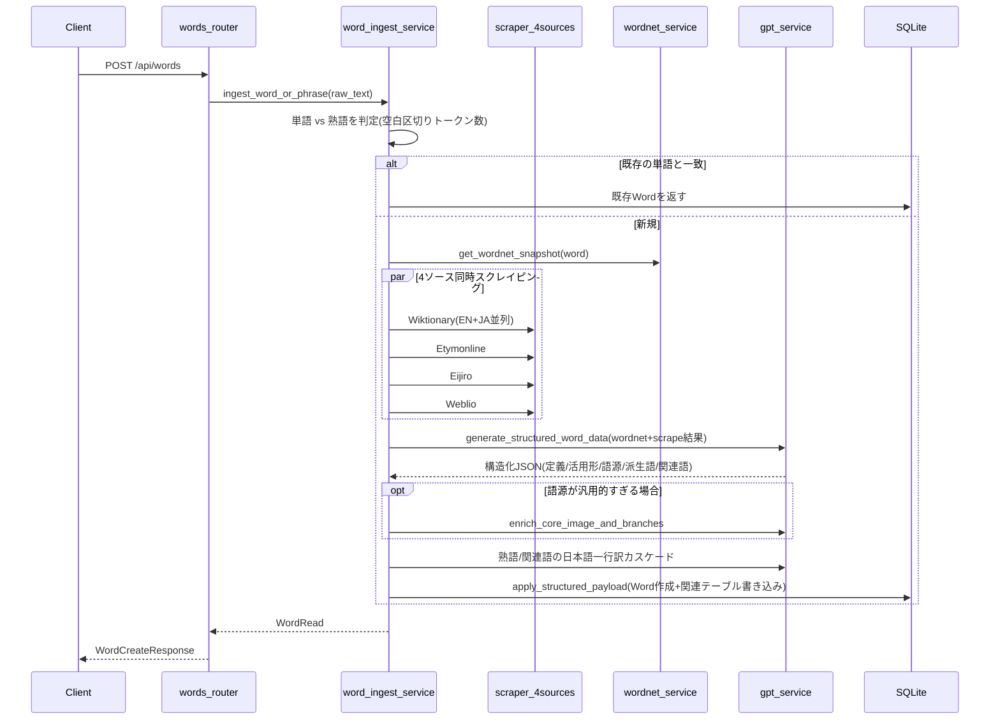
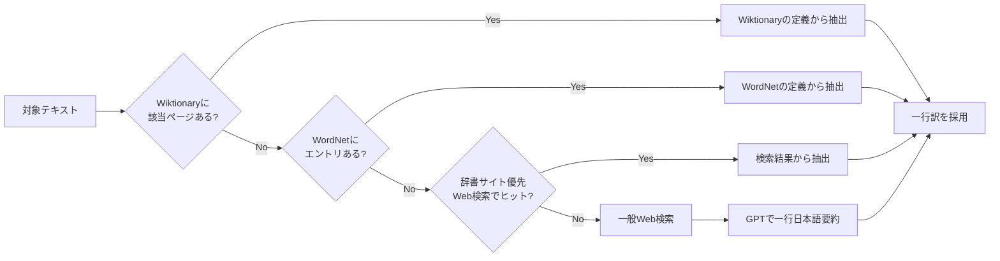

# Feature 01. 単語（Word）

前提：`00_overview.md`、`backend/02_database.md`（クラスタ1: 単語コア）、`backend/03_api.md`（wordsセクション）、`backend/04_services.md` を読んでいること。テーブル定義・エンドポイント仕様・サービス一覧はここでは再掲せず、上記へリンクする。

単語（`words`テーブル、以下Word）は本アプリの中心エンティティである。本ファイルでは、単語・熟語に共通する**登録パイプライン**（新規作成時に何が起こるか）と、Word固有の閲覧・編集フローを説明する。熟語（`Phrase`）はこのパイプラインを共有しつつ熟語固有のステップを持つため、共有部分はここで一度だけ説明し、`features/02_phrase.md` はここにリンクして差分のみを書く。

## 登録パイプラインの全体像

エントリポイントは `word_ingest_service.ingest_word_or_phrase()`。`POST /api/words` の他、一括登録（`POST /api/words/bulk`）、`database_build word add`、熟語登録経路（`features/02_phrase.md`）からも呼ばれる共通パイプラインである。

### 1. 入力分類

`is_phrase_text()` が空白区切りトークン数を見て、2語以上なら熟語パス（`features/02_phrase.md`）、1語なら単語パスへ進む。

### 2. 4ソース同時スクレイピング

`asyncio.gather` で4つのスクレイパーを並列実行する（`core/services/scraper/__init__.py: build_scrapers()`）。ソースごとに使われ方が大きく異なる点に注意。

| ソース | 取得方法 | 用途 |
|---|---|---|
| Wiktionary | MediaWiki API（`action=parse`）で英語版・日本語版を並列取得し、wikitext/テンプレートを構造化パース | 定義・活用形・語源・派生語・関連語の**主たる構造化データ源** |
| Etymonline | HTML取得→BeautifulSoupで圧縮テキスト化（`compact_text`、1400文字） | GPTへの**補助的な生テキスト文脈**のみ |
| Eijiro（英辞郎） | 同上 | 同上（日英対訳の補助文脈） |
| Weblio | 同上 | 同上（別の日本語辞書としての補助文脈） |

Wiktionaryのスクレイプ結果は `data/scrape_cache/<word>.json` にファイルキャッシュされ、同じ単語の再取り込みではネットワークアクセスをスキップする（`backend/01_architecture.md` のキャッシュ表参照）。

### 3. WordNetスナップショット

`wordnet_service.get_wordnet_snapshot(word)` がNLTK WordNetからシナプス・レンマ・定義・例文を取得し、GPTへの入力の一部とする。

### 4. GPT構造化呼び出し

`gpt_service.generate_structured_word_data`（同期）または `gpt_service_parallel.generate_structured_word_data_async`（非同期並列、デフォルト）が、WordNet＋4ソースのスクレイプ結果を入力に、プロンプト `word_structuring.md` を使ってOpenAI Responses APIを呼び、定義・活用形・語源・派生語・関連語を含む構造化JSONを生成する。`openai_api_key` が未設定の場合は `_fallback_structured`（WordNet/Wiktionaryのみに基づくルールベース構築、LLM不使用）にフォールバックする。

定義（意味）は、Wiktionaryの複数センスをそのままGPTに渡す前に `definition_cluster_service.cluster_definitions_sync` でembedding類似度に基づき重複統合・品詞ごと最大8件にキャップされる。

### 5. 語源補完パス

構造化結果の語源が「汎用的すぎる」（`core_image`がプレースホルダーのよう、または`branches`が空）と判定された場合、`enrich_core_image_and_branches[_async]` が追加のGPT呼び出し（プロンプト `etymology_enrichment.md`）で `core_image`/`branches` のみを埋める。この補完パスは単語登録時だけでなく単語詳細ページからのオンデマンド実行（`POST /api/words/{id}/enrich-etymology`）でも起動する。語源データモデル自体の詳細は `features/03_etymology.md` を参照。

### 6. 熟語・関連語の日本語一行訳解決カスケード

構造化結果に含まれる `forms.phrases`（多語の成句）や、多トークンの `related_words` には、以下のフォールバック順で日本語一行訳を解決する（`phrase_meaning_service.resolve_meaning_ja`）。

この解決結果は1回の取り込みバッチ内で `meaning_cache`/`phrase_cache`（プロセス内dict）に記憶され、同じテキストへの重複解決を避ける（永続キャッシュではない）。

### 7. 永続化

`word_service.apply_structured_payload()` が以下の順で書き込む：`Word` 作成 → `Definition`＋`DefinitionExample` 置き換え → `Etymology`＋語源サブテーブル群の作成/更新 → `Derivation` 置き換え（カンマ区切りを分割） → `RelatedWord` の追記マージ（手動編集分を消さない） → `replace_word_phrases` による熟語のリンク/作成。最後に `link_existing_phrases_for_word` が、この単語をトークンとして含む既存の `Phrase` も走査してリンクする。対象テーブルは `backend/02_database.md` クラスタ1・2・3を参照。

## 単語の閲覧・編集

- **WordDetailPage**（`/words/:wordKey`）：意味・語源マップ・派生語・関連語・画像・チャットを表示する読み取り専用ビュー。`wordKey` はIDまたは単語テキストのいずれかを受け付ける（`GET /{word_id}` または `GET /by-text/{word_text}`）。閲覧のたびに `last_viewed_at` が更新される。
- **WordEditPage**（`/words/:wordKey/edit`）：タブ構成の手動編集画面（基本情報/活用形/派生語/成句・慣用句/語源/語源バリエーション/関連語）。`PUT /{word_id}/full` で一括更新する。コンポーネント構成は `frontend/02_components.md` の `word-edit/WordEditTabs.tsx` 系を参照。
- **再スクレイプ**（`POST /{word_id}/rescrape`）：登録パイプラインのスクレイプ〜GPT構造化を単語単体に対して再実行する。
- **語源のみ再補完**（`POST /{word_id}/enrich-etymology`）：上記手順5のみを単独で再実行する。

## 活用形統合との関わり

新規登録時、入力語が既存の別の単語の活用形（例：`went` は `go` の活用形）である可能性がある場合、`POST /api/words/check-inflection` の結果に基づき、フロントエンドは登録前に `InflectionBatchModal` でユーザーに `merge`/`link`/`register_as_is` を選ばせる（`POST /api/words` のクエリパラメータ `inflection_action` で指定）。この判定・マージロジックの詳細は `features/08_inflection_lemma_merge.md` を参照。
