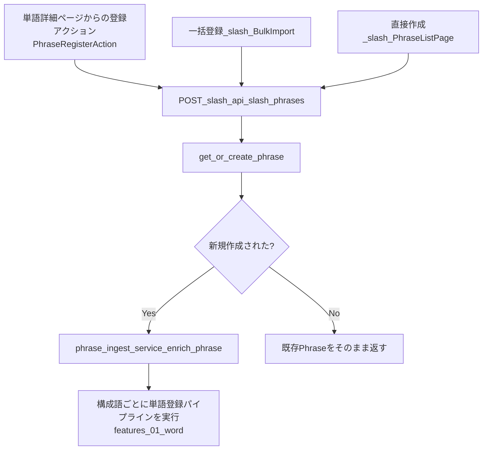

# Feature 02. 熟語（Phrase）

前提：`features/01_word.md`（登録パイプラインの共有部分）、`backend/02_database.md`（クラスタ3: 熟語）、`backend/03_api.md`（phrasesセクション）を読んでいること。共有パイプライン（スクレイピング〜GPT構造化〜永続化の一般的な流れ）はここでは再掲せず、熟語固有の差分のみを記述する。

## 熟語登録の複数経路

熟語は複数の入り口から登録されるが、いずれも最終的に同じ「熟語エンリッチ処理」に合流する。

`RelatedWords`/`PhraseWiktionaryRelations`/`PhraseListPage` は共通フック `usePhraseRegistration.ts`（`frontend/02_components.md`）を使って、候補テキスト群の既存チェック→未登録分の一括登録を行う。

## 熟語固有のステップ（`word_ingest_service`／`phrase_ingest_service`）

1. **トークン化・正規化**：`normalize_phrase_for_store` が入力を正規化し、プレースホルダートークン（`A`/`B`/`C`/`O`/`S`/`~` 等、文法的な穴を表す）を統一する（例：`"do A's best"`）。
2. **初期日本語訳**：`resolve_meaning_ja_ddgs` がWiktionary/WordNetを使わず、Web検索結果のみからフレーズ全体の一行訳を暫定取得する。
3. **`get_or_create_phrase`**（`phrase_service.py`）：正規化テキストで一意な `Phrase` 行を検索、なければ作成する（`SAVEPOINT`で競合安全）。
4. **新規時のみ：熟語エンリッチ**（`phrase_ingest_service.enrich_phrase`）：
   - `phrase_meaning_service.resolve_meaning_ja` で正式な一行訳を取得（`features/01_word.md` の日本語訳解決カスケードと同じロジックを再利用）
   - Wiktionaryで熟語ページをスクレイプ（`phrase_cache` でバッチ内キャッシュ）
   - 最大12件のセンスを優先順位付きで抽出（`_pick_definition_items`：phrase＞verb＞noun＞adjective＞adverb）
   - 各センスをGPTで日本語訳（`gpt_service.translate_phrase_definitions`、プロンプトファイルではなくインラインプロンプト）
   - `phrase_service.replace_definitions` で `PhraseDefinition` 行と `wiktionary_synonyms`/`antonyms`/`see_also`/`derived_terms`/`phrases`（JSON列）を書き込む
5. **構成語との紐付け**：熟語内の非プレースホルダートークンごとに、`features/01_word.md` の単語登録パイプラインを実行（`backfill_existing_etymology=True` 付き＝既存単語で語源が空なら補完する）し、`link_phrase_to_word` で `WordPhrase` 中間テーブルに書き込む。

## フロントエンド固有の挙動

- **`PhraseListPage`**（`/phrases`）：検索・ソート・無限スクロール。検索結果0件時、その場で新規熟語登録を促すUIを表示する。
- **`PhraseDetailPage`**（`/phrases/:phraseId`）：定義・Wiktionary関連語・構成語（`PhraseComponentWords`）・画像・チャットの読み取り専用ビュー。「Wiktionaryから再取得」アクション（`POST /phrases/{id}/enrich`）を持つ。
- **`PhraseEditPage`**（`/phrases/:phraseId/edit`）：4タブ編集（基本情報/定義/構成語/関連語）。Wiktionary関連語配列を編集可能な統合リストに変換して扱う。`PUT /phrases/{id}/full` で保存。

画像生成・チャットの仕組み自体は熟語固有ではなく共通機構なので、それぞれ `features/07_image_generation.md`・`features/06_chat.md` を参照。
