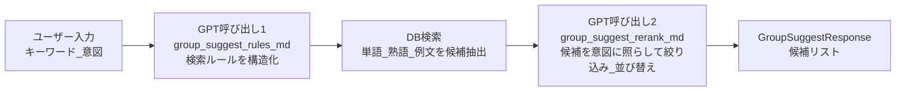

# Feature 04. グループ（Collections）

前提：`backend/02_database.md`（クラスタ4: グループ）、`backend/03_api.md`（groupsセクション）を読んでいること。

グループ（`WordGroup`）は、単語・熟語・例文を自由にまとめられる学習用コレクション機能である。`word_group_items.item_type` が `word`/`definition`（例文付き）/`phrase` のいずれかを表す。

## AI提案パイプライン（`group_suggest_service.py`）

グループ編集画面の「AIで追加」タブでは、ユーザーが入力したフリーテキストのキーワード・意図から候補を提案する2段階LLMパイプラインを使う。

1回目のGPT呼び出し（プロンプト `group_suggest_rules.md`）でユーザーの意図をDB検索用のルール（キーワード・品詞・関係種別など）に構造化し、そのルールでDBを検索して候補を集める。2回目のGPT呼び出し（プロンプト `group_suggest_rerank.md`）が、集めた候補を元の意図に照らして絞り込み・再ランキングする。

## グループ編集の5タブ

`GroupEditPage`（`/groups/:groupId/edit`）は以下の5タブで構成される（コンポーネント詳細は `frontend/02_components.md` の `group-edit/`・`group-candidates/` を参照）。

| タブ | 操作 |
|---|---|
| 基本情報 | 名前・説明の編集 |
| 手動追加 | キーワード検索（単語＋熟語横断）から複数選択して追加 |
| 一括追加 | 改行区切りテキストの一括追加。既存チェック→未登録分は自動で単語/熟語登録パイプライン（`features/01_word.md`/`02_phrase.md`）を実行してから追加 |
| AIで追加 | 上記のAI提案パイプライン（単語/例文/熟語のサブタブ） |
| 登録済み | 現在のアイテム一覧、個別削除 |

手動追加・AI提案タブの複数選択状態は共通フック `useGroupCandidateSelection.ts` が管理し、既に追加済みのアイテムを無効化/バッジ表示する。

## グループ画像・チャットへの導線

グループにも公式画像（`GroupImage`）とグループスコープのチャット（`GroupChatPanel`）がある。それぞれの仕組み自体は共通機構なので、詳細は `features/07_image_generation.md`・`features/06_chat.md` を参照。
