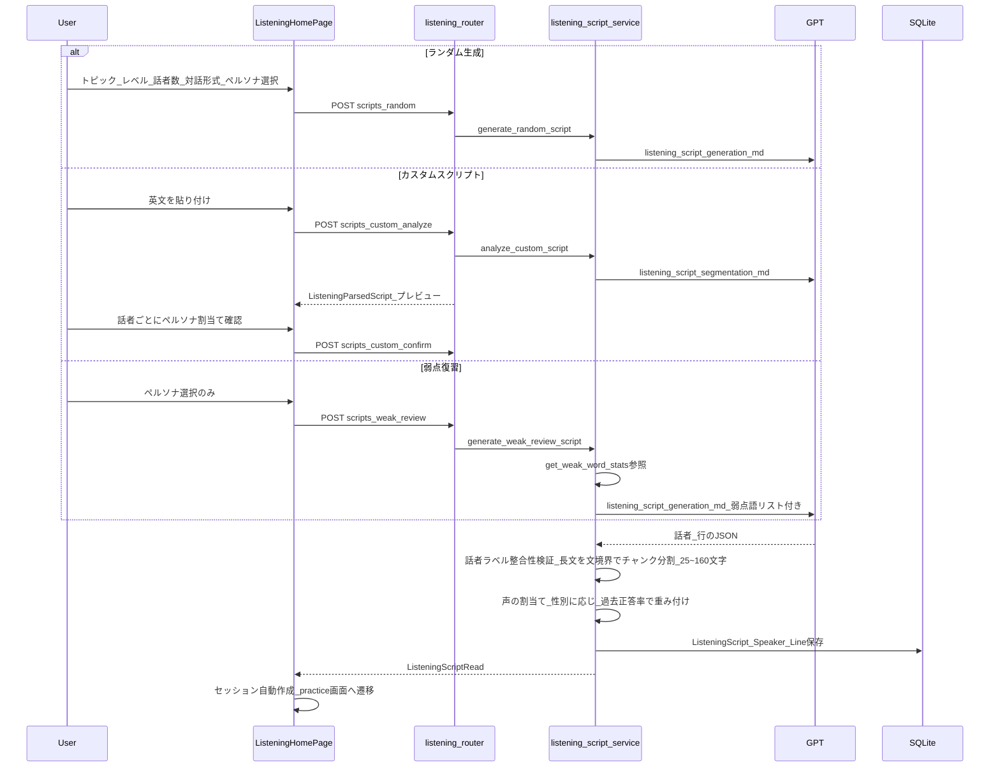
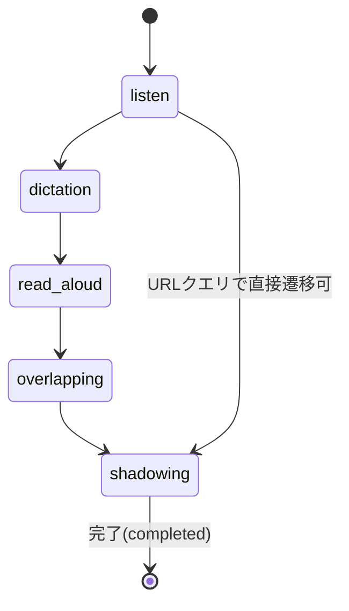
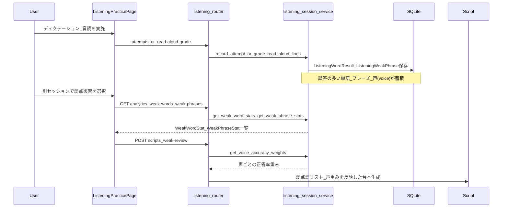

# Feature 05. リスニング練習

前提：`00_overview.md`、`backend/02_database.md`（クラスタ6: リスニング）、`backend/03_api.md`（listeningセクション）、`backend/04_services.md`（`listening_*` サービス群・personas）、`frontend/01_architecture.md`（ルーティング）を読んでいること。8テーブル・18エンドポイント・5つの専用サービス・複数ステップのフロントエンドUIを持つ、このアプリで最大の機能である。

## 概要

AIが生成したTOEIC形式の台本を、6種類のTTSペルソナ（`backend/04_services.md`）の音声で読み上げ、「聞く→ディクテーション→音読→追っかけ→シャドーイング」の5ステップで練習する。ディクテーション・音読の誤答は単語・フレーズ単位で記録され、集計されて次の台本生成（弱点復習モード）や音声の難易度重み付けにフィードバックされる。この**弱点分析→フィードバックループ**が、他の機能にはないこのアプリ独自の設計である。

## 台本生成

3つの生成経路があり、いずれも最終的に `ListeningScript` → `ListeningSpeaker` → `ListeningLine` の階層構造を作る。

- ランダム生成・弱点復習は温度0.8のGPT呼び出し（`listening_script_generation.md`）、カスタムスクリプト解析は温度0.0（`listening_script_segmentation.md`、決定的な分割を優先）。
- 話者ラベルの整合性検証：LLMが返す各行の `speaker_label` が、宣言済みの話者と一致しない場合はエラーとして扱う。
- 声（`voice`）の割当ては話者の性別に対応するペルソナから選ぶが、`get_voice_accuracy_weights`（下記フィードバックループ参照）により、ユーザーが過去に聞き取りづらかった声を意図的に混ぜる重み付けがされる。

## TTSペルソナと行音声

台本内の各話者（`ListeningSpeaker`）は1つのペルソナ（=OpenAI TTS音声ID）に固定される。1行（`ListeningLine`）に対して複数の声のバリアント（`ListeningLineAudio`）を後から追加生成でき、`is_primary` がデフォルト再生される音声を示す。音声合成自体は `tts_service.synthesize_speech`（`openai_tts_model`＝`tts-1`）を `listening_audio_service.generate_line_audio` がラップする。ペルソナ選択UI（`PersonaPicker`）は、サンプル音声を `get_or_create_persona_sample` でキャッシュ済み固定ファイル名（`persona-sample-<voice>.mp3`）として遅延生成する。

## 5ステップ練習フロー

`ListeningSession.current_step` はDB上5値（`listen`/`dictation`/`read_aloud`/`overlapping`（追っかけ）/`shadowing`）のいずれかを持つが、ステップ間の遷移は厳密な一方向強制ではなく、`ListeningStepNav`（`frontend/02_components.md`）から任意のステップに移動でき、現在のステップと再生速度・ディクテーションレベルはURLクエリパラメータに同期される（リロード・共有リンクでの再開に対応）。各ステップの挙動：

| ステップ | 挙動 |
|---|---|
| 聞く（listen） | `PlaybackControls`で速度調整しながら台本を再生 |
| ディクテーション | 下記の穴埋めアルゴリズムで一部の単語を空欄化し、ユーザーが書き取る |
| 音読（read_aloud） | マイクで音読を録音、Whisperで文字起こし後に採点 |
| 追っかけ（overlapping） | 音声を聞きながら少し遅れて追いかけて発話（台本テキストは表示） |
| シャドーイング（shadowing） | 台本テキストを隠して音声のみを頼りに発話（`showText=false`） |

`ScriptViewer.tsx` は「⬇ 全部生成」（未生成の行音声を並列数3で一括生成）、「▶ 全部再生」（選択速度で逐次再生、再生中の行をハイライト）、行ごとの「聴き比べ」（`VoiceCompareModal`→`VoiceComparePanel`：既存の声バリアント一覧の再生＋未使用ペルソナでの追加生成）を提供する。

## 穴埋め選択アルゴリズム（ディクテーション）

`frontend/src/components/listening/dictationBlanks.ts` が、乱数を使わない決定的なロジックで、どの単語を空欄にするかを選ぶ。優先順位は以下の通り（数字が小さいほど優先＝空欄になりやすい）。

1. **機能語**（冠詞・前置詞・助動詞・代名詞・接続語）：弱く読まれ聞き取りにくいため最優先
2. **句動詞・コロケーション**（例：`turn in`/`call up`/`pick up` など、隣接2語をセットで空欄化）：連結・脱落が起きやすい
3. **語尾変化**（`-ing`/`-ed`/`-er`/`-es`/`-s`）：語幹は聞こえても語尾を落としやすい
4. **TOEIC頻出内容語**（`attest`/`expedite`/`feasible` 等の固定語彙リスト）：意味からの予測力も鍛える
5. **その他**

ディクテーションレベル（`dictation_level`：全文表示/穴埋め少/穴埋め多/白紙）に応じて空欄化する単語数を調整し、文全体に均等に分散させる。

## 採点

- **ディクテーション**：ユーザーが再構成した行を `POST /sessions/{id}/attempts` に送信し、`listening_session_service.record_attempt` が単語単位で正誤判定（`ListeningWordResult`）。
- **音読**：録音音声を `POST /sessions/{id}/read-aloud-grade` にアップロード→Whisper（`openai_transcribe_model`）で文字起こし→`difflib.SequenceMatcher` による単語レベルのアライメントで正誤判定→2語以上連続で間違えた箇所が既存の `phrases` テーブルの熟語と一致すれば `ListeningWeakPhrase` として記録。スコア・誤り箇所をもとに `listening_feedback_service.generate_pronunciation_feedback`（プロンプト `read_aloud_feedback.md`、温度0.4）がLLMで日本語の発音フィードバック（良い点・改善点）を生成し、APIキー未設定時やLLM失敗時はテンプレートベースのフォールバック（`build_fallback_good_points`/`build_fallback_review_points`）を返す。

## 弱点分析とフィードバックループ

このアプリで最も独自性の高い部分。

- `get_weak_word_stats`/`get_weak_phrase_stats`：`ListeningWordResult`/`ListeningWeakPhrase` を集計し、誤答率の高い単語・フレーズを算出。`WeakWordsPanel`/`WeakPhrasesPanel`（`ListeningHomePage`のサイドバー）で表示され、対応する単語/熟語詳細ページへのリンクを持つ。
- `get_voice_accuracy_weights`：`listening_attempts.voice` を使い、声（ペルソナ）ごとの正答率を集計。正答率が低い＝聞き取りづらい声を、今後の台本生成で意図的に多めに割り当てることで、苦手な声への曝露を増やす。

## フロントエンド固有の操作フロー

- **`ListeningHomePage`**（`/listening`）：4タブ（ランダム生成/カスタムスクリプト/弱点復習/過去のセッション）。過去のセッション一覧は再開リンクと削除（確認ダイアログ付き）を持つ。
- **`ListeningPracticePage`**（`/listening/sessions/:sessionId`）：`useListeningSession(sessionId)`（`frontend/02_components.md`）がセッション・台本の取得、ステップ/速度/ディクテーションレベル/ステータスの更新、試行記録をまとめて提供する。「練習を完了する」でセッションを `completed` にする。

台本・セッションのテーブル定義は `backend/02_database.md`、エンドポイント一覧は `backend/03_api.md` を参照。
