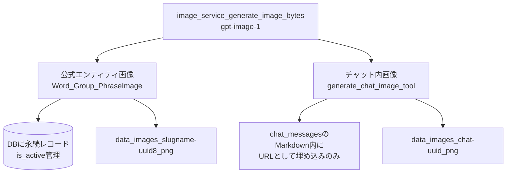

# Feature 07. 画像生成

前提：`backend/02_database.md`（`word_images`/`group_images`/`phrase_images`）、`backend/03_api.md`（imagesセクション）、`backend/04_services.md`（`image_service.py`）、`features/06_chat.md`（`generate_chat_image`ツール）を読んでいること。**画像生成の仕組みはこのファイルにのみ記述する**。

このアプリには見た目が似ているが仕組みの異なる2種類の画像生成機能があり、いずれも同じ `image_service.generate_image_bytes`（OpenAI画像API、`openai_image_model`＝`gpt-image-1`、サイズ`openai_image_size`）を土台にしている。

## 公式エンティティ画像

単語・グループ・熟語それぞれに、詳細ページに表示される「公式画像」がある。

- **プロンプト構築**：`build_image_prompt`（単語）/`build_group_image_prompt`（グループ）/`build_phrase_image_prompt`（熟語）が、それぞれのプロンプトテンプレート（`image_generation.md`/`group_image_generation.md`/`phrase_image_generation.md`）にDBから組み立てたテキスト要約（単語なら `core_image`・`raw_description`・意味分岐の要約、意味分岐は語源branches→定義→component_meanings→etymology_variants→WordNetスナップショットの順にフォールバック）を埋め込む。
- **生成**：`POST /api/words/{id}/generate-image` 等（`backend/03_api.md`）。APIキー未設定またはAPI呼び出し失敗時は、1×1透明PNGのプレースホルダーが書き込まれ、フロー自体は失敗しない。
- **保存**：`data/images/`（`{slug(word)}-{uuid8}.png`/`group-{id}-{uuid8}.png`/`phrase-{slug}-{uuid8}.png`）にファイルを保存し、`WordImage`/`GroupImage`/`PhraseImage` 行に `file_path`（相対パス、例：`images/foo.png`）・`prompt`・`is_active=true` を記録する。新しい画像を生成すると、そのエンティティの過去の画像は `is_active=false` になる（削除ではなくソフト履歴）。`/static` マウント経由で `/static/images/<filename>` として配信される。
- **フロントエンド**：`ImageViewer.tsx`（単語/熟語/グループ詳細ページに表示）。

## チャット内画像

`features/06_chat.md` の `generate_chat_image` ツールが、チャットの会話の流れの中でLLM自身が判断して呼び出す。生成された画像は `data/images/chat-<uuid>.png` として保存され、URLがそのままアシスタントの返信Markdown内に埋め込まれる（`chat_messages.content` の一部としてのみ存在）。

## 何が違うか

| 観点 | 公式エンティティ画像 | チャット内画像 |
|---|---|---|
| 永続化 | `WordImage`/`GroupImage`/`PhraseImage` にDBレコードとして残る | 専用テーブルなし。`chat_messages.content` 内のMarkdownとしてのみ存在 |
| 履歴管理 | `is_active` によるソフト履歴（複数世代保持） | なし（1回生成したら終わり、チャット内画像専用の再生成UIもない） |
| プロンプト構築 | エンティティのDB情報から自動構築（`build_*_image_prompt`＋専用テンプレート） | LLMがその場の会話文脈から自由に組み立てる |
| ファイル命名 | `{slug}-{uuid8}.png`（単語/グループ/熟語ごとに異なる接頭辞） | `chat-<uuid>.png` |
| 削除 | 新しい画像生成時に過去分が自動的に非アクティブ化（明示的な削除操作は無し） | 削除の概念自体が無い（チャットメッセージごと削除されれば消える） |
| トリガー | ユーザーがボタンを押す（`POST .../generate-image`） | LLMがチャット中に自律的に呼び出す（function calling） |
