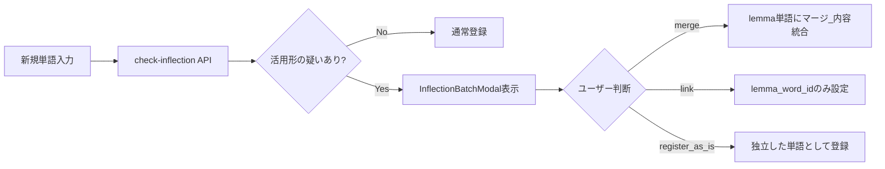

# Feature 08. 活用形統合（Inflection / Lemma Merge）

前提：`backend/02_database.md`（`words`テーブルの`lemma_word_id`/`inflection_type`）、`backend/03_api.md`（wordsセクションの `/check-inflection`、migrationセクション）、`backend/05_cli.md`（`inflection`サブコマンド）を読んでいること。

## 目的

`go`/`goes`/`went`/`going`/`gone` のように、1つの見出し語（lemma）が複数の活用形を持つ英単語において、それぞれの活用形を別々の `Word` レコードとして重複登録してしまうことを防ぎ、活用形をlemmaにリンクまたはマージする仕組み。

## データモデル

`words.lemma_word_id`（自己参照FK、`ON DELETE SET NULL`）と `words.inflection_type` は、**`001_initial_schema` の時点から存在する**（`backend/02_database.md` 参照）。つまりデータベース設計自体は初期から活用形統合を想定していたが、それを扱うツール（CLI・UI）は後から段階的に追加されたものである。

## マージ処理

- **`lemma_service.py`**：ある単語が既存の別単語の活用形かどうかを検出する。判定材料は、対象単語の `forms`（JSON）に記録された活用形、所有格ヒューリスティック、NLTKレンマタイザー、Wiktionary、Web検索。複数のlemma候補が見つかった場合はスコアリングして最有力候補を提示し、`merge`/`link`/`register_as_is` のいずれかを提案する。
- **`word_merge_service.py`**：
  - `merge_into_lemma`：活用形単語の定義・派生語・関連語・画像などをlemma単語側に統合し、内容が重複するものは除外（コンテンツキーでの重複排除）。統合後、活用形単語自体は削除される想定。
  - `link_to_lemma`：内容はマージせず、`lemma_word_id` のリンクのみを設定する（活用形単語のレコード自体は残す）。

## CLIサポート

`database_build inflection import --input CSV` でlemma/活用形の対応関係を一括インポートし、`database_build inflection report --output CSV [--apply-known-fixes]` で疑わしい活用形単語とlemma候補のレポートを生成できる（詳細は `backend/05_cli.md`）。

## フロントエンド

- **単語登録時**：`POST /api/words/check-inflection` の結果に基づき、登録前に `InflectionBatchModal`（`frontend/02_components.md`）でユーザーに判断を仰ぐ（`features/01_word.md` 参照）。`createWordsWithInflectionCheck.ts` が一括登録フロー（HomePage/GroupEditPage）でこれを統合している。
- **dev限定の一括処理画面**：`DevInflectionMigrationPage`（`/dev/migration/inflection`）が、lemma未解決の既存単語を一括ロードし、`check-inflection` を実行、`InflectionBatchModal` でレビューした上で `migrationApi`（`GET/POST /api/migration/inflection/...`）経由でマージ/リンク判断をまとめて適用する。`DevInflectionModalPage`（`/dev/inflection-modal`）はUIプレビュー専用で、ハードコードされたサンプルデータに対して動作確認するのみ。

## 現状の成熟度についての注記

データベーススキーマ（初期から存在）・バックエンドサービス（`lemma_service.py`/`word_merge_service.py`）・CLI（`database_build inflection`）は実用的に機能する水準にあるが、**主要なUI導線は依然としてdev限定ページ（`/dev/migration/inflection`）に留まっており、本線の単語一覧・単語詳細ページには活用形の一括レビュー機能として統合されていない**。単語登録時の `check-inflection` フローは本線に統合済みだが、既存の未解決データを事後的に整理する手段は現状dev向けツールのみである。
