# Frontend 01. アーキテクチャ

前提：`00_overview.md`、`backend/03_api.md` を読んでいること。

## ルーティング一覧（`frontend/src/App.tsx`）

React Router、全ルートは共有の `<Layout />`（`frontend/02_components.md` 参照）配下にネストされる。`main.tsx` が `QueryClientProvider`（TanStack Query、staleTime 60秒、フォーカス時の自動refetchなし）と `BrowserRouter` で全体をラップする。

| パス | コンポーネント | 概要 |
|---|---|---|
| `/` | `HomePage` | 単語検索・追加・一括登録・一覧 |
| `/etymology-search` | `EtymologySearchPage` | 語源コンポーネントの検索 |
| `/etymology-components/:componentText` | `EtymologyComponentPage` | 語源コンポーネント詳細 |
| `/listening` | `ListeningHomePage` | リスニング練習のハブ（台本生成・過去セッション） |
| `/listening/sessions/:sessionId` | `ListeningPracticePage` | リスニング練習セッション画面 |
| `/groups` | `GroupListPage` | グループ一覧 |
| `/groups/:groupId` | `GroupDetailPage` | グループ詳細（閲覧） |
| `/groups/:groupId/edit` | `GroupEditPage`（`GroupEditPageForRoute` 経由） | グループ編集 |
| `/phrases` | `PhraseListPage` | 熟語一覧 |
| `/phrases/:phraseId` | `PhraseDetailPage` | 熟語詳細（閲覧） |
| `/phrases/:phraseId/edit` | `PhraseEditPage` | 熟語編集 |
| `/words/:wordKey` | `WordDetailPage` | 単語詳細（`wordKey` はID または単語テキスト） |
| `/words/:wordKey/edit` | `WordEditPage` | 単語編集 |
| `/dev/inflection-modal`（dev限定） | `DevInflectionModalPage` | `InflectionBatchModal` のプレビュー用（本番ビルドに含まれない） |
| `/dev/migration/inflection`（dev限定） | `DevInflectionMigrationPage` | 活用形統合の一括処理用dev画面 |
| `*` | — | `/` にリダイレクト |

`GroupEditPageForRoute` は、グループ間を直接遷移した際（`groupId` パラメータのみ変化）に `GroupEditPage` がremountされず、前のグループの編集用ローカルstateが引き継がれてしまう問題を避けるため、`key={groupId}` を指定して強制的にremountさせるラッパーである。

## ディレクトリ構成と規約

```
frontend/src/
  pages/            画面単位のコンテナ（データ取得＋UI組み立て）
  components/        再利用コンポーネント
    atom/             最小単位のUIプリミティブ（Card, Stack, Row, Field, Chip等）
    common/           Tabsなど、機能に依存しない共通部品
    group-candidates/ グループのAI提案・手動追加の候補表示
    group-edit/       グループ編集の5タブ
    phrase-edit/      熟語編集の4タブ
    word-edit/        単語編集のタブ集約（WordEditTabs）
    listening/        リスニング練習UI一式
  lib/               APIクライアント・共通フック・定数
  types/             ドメイン型定義（index.ts）
```

「`pages/` がデータ取得とAPI呼び出しを持ち、`components/` は表示ロジック中心」という分担が概ね貫かれている。コンポーネント一覧の詳細は `02_components.md` を参照。

## APIクライアント（`frontend/src/lib/api.ts`）

単一のaxiosインスタンス（`api`、baseURLは `VITE_API_BASE_URL` またはビルド時注入の `config.yaml` デフォルト値）。GET/HEAD/OPTIONSに対して、ネットワークエラー時に指数バックオフで最大3回リトライするインターセプターを持ち、接続断/復帰時に `window` イベント（`api-connection-error`/`api-connection-recovered`）を発火する（`Layout.tsx` が購読し、接続断バナーを表示）。

| 名前空間 | 対応バックエンドルーター | 備考 |
|---|---|---|
| `wordApi` | `/api/words`, `/api` (images/audio) | list/search/suggest/get/create/bulkCreate/check/checkInflection/rescrape/delete/updateDefinition/updateEtymology/updateFull/derivation系/relatedWord系/generateImage/generateAudio/generateExampleAudio/listPhrases/addPhrase/removePhrase 等 |
| `chatApi` | `/api`（chat, words scope） | sessions/createSession/messages/sendMessage/updateSession/deleteSession（単語スコープ） |
| `componentChatApi` | `/api`（chat, etymology-components scope） | sessions/createSession（語源要素スコープ） |
| `groupChatApi` | `/api`（chat, groups scope） | sessions/createSession（グループスコープ） |
| `phraseChatApi` | `/api`（chat, phrases scope） | sessions/createSession（熟語スコープ）。メッセージ送受信は全スコープ共通で `chatApi.messages`/`sendMessage` をセッションIDで呼ぶ |
| `componentApi` | `/api/etymology-components` | list/create/get/rescrape |
| `groupApi` | `/api/groups` | list/create/get/update/delete/addItem/removeItem/bulkAddItems/suggest/generateImage/getDefaultImagePrompt |
| `phraseApi` | `/api`（phrases） | list/get/create/check/update/updateFull/listWords/enrich/generateImage/getDefaultImagePrompt/generateAudio/generateDefinitionAudio/delete |
| `searchApi` | `/api/search` | suggest（ヘッダー検索バー用） |
| `listeningApi` | `/api/listening` | getPersonas/getPersonaSample/generateRandomScript/analyzeCustomScript/confirmCustomScript/generateWeakReviewScript/getScript/generateLineAudio/getLineAudioVariants/gradeReadAloud/createSession/getSession/updateSession/recordAttempt/listSessions/deleteSession/getWeakWords/getWeakPhrases |
| `migrationApi` | `/api/migration` | listInflectionTargets/applyInflection（dev運用向け） |

エンドポイントの詳細な仕様は `backend/03_api.md` を参照。

## 共有設定のブリッジ

ルート直下の `config.yaml` はbackend/frontend双方から参照される非機密設定（`group_name_max_length`/`api_base_url_default`）。`frontend/vite-plugin-config.ts` がビルド時にこれを読み込み、Viteの `define` で `__SHARED_GROUP_NAME_MAX_LENGTH__`/`__SHARED_API_BASE_URL_DEFAULT__` としてバンドルに埋め込む。`frontend/src/lib/sharedConfig.ts` がこれらを再エクスポートし、`lib/constants.ts`（`GROUP_NAME_MAX_LENGTH`）や `lib/api.ts`（baseURLのフォールバック）から利用される。詳細は `backend/01_architecture.md` の設定セクションを参照。

## 型定義の全体像（`frontend/src/types/index.ts`）

主なクラスタ：
- 単語コア：`Word`/`WordSummary`/`WordForms`/`Definition`/`Etymology`系/`Derivation`/`RelatedWord`/`WordImage`
- 熟語：`Phrase`/`PhraseDefinition`/`PhraseImage`
- グループ：`WordGroup`/`WordGroupItem`/`GroupItemType`/`GroupImage`
- チャット：`ChatSession`/`ChatMessage`/`ChatReply`
- 検索：`SearchSuggestItem`
- 活用形統合：`InflectionAction`/`InflectionCheckResult`/`MigrationInflectionTarget(s)`系
- **リスニング（最大クラスタ）**：`ListeningStep`/`ListeningPersona`/`ListeningParsedScript`/`ListeningSpeaker`/`ListeningLine`/`ListeningScript`/`ListeningSession`/`ListeningAttempt`/`ListeningReadAloudGrade`/`WeakWordStat`/`WeakPhraseStat` 等

個々の型の全フィールドはソース（`types/index.ts`）を直接参照すること（本ファイルでは網羅列挙しない）。

## ルーティングマップ

```mermaid
graph TD
  Layout[Layout_shared_shell] --> Home[HomePage_slash]
  Layout --> EtySearch[EtymologySearchPage]
  Layout --> EtyComp[EtymologyComponentPage]
  Layout --> ListenHome[ListeningHomePage]
  Layout --> ListenPractice[ListeningPracticePage]
  Layout --> GroupList[GroupListPage]
  Layout --> GroupDetail[GroupDetailPage]
  Layout --> GroupEdit[GroupEditPage]
  Layout --> PhraseList[PhraseListPage]
  Layout --> PhraseDetail[PhraseDetailPage]
  Layout --> PhraseEdit[PhraseEditPage]
  Layout --> WordDetail[WordDetailPage]
  Layout --> WordEdit[WordEditPage]
```


