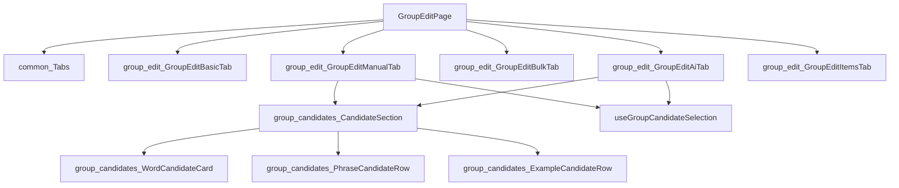

# Frontend 02. コンポーネント・フック一覧

前提：`00_overview.md`、`01_architecture.md` を読んでいること。個々の機能の動作フローは書かず、「何がどこにあるか」の索引に徹する。

## `components/atom/`（最小単位のUIプリミティブ）

| コンポーネント | 概要 |
|---|---|
| `Card` | 多態的なコンテナ（`card`/`subcard`、`as`propで`<Link>`等に差し替え可） |
| `Stack` | 縦方向flexレイアウト |
| `Row` | 横方向flexレイアウト（`start`/`between`） |
| `Chip` / `ChipList` | ピル型タグ、`onClick`指定でボタン化 |
| `Field` | ラベル付きフォームフィールド |
| `Muted` | 補助テキスト用の多態的span |
| `LoadingBanner` | 「読み込み中/通信中」インラインバナー |
| `FormBlockLayout` | 繰り返しフォームブロック（削除ボタン付き）の共通レイアウト |
| `PosSelect` | 品詞選択`<select>` |
| `RadioButtonGroup` | 説明文付きラジオボタングループ |
| `utils.ts` | `cx()` クラス名結合ヘルパー |

`common/Tabs.tsx` は atom ではないが、全タブ付き画面で使われる汎用タブバー。

## `pages/`（画面一覧）

| ページ | 概要 |
|---|---|
| `HomePage` | 単語追加（活用形検出フロー付き）、一括登録、無限スクロール一覧、ソート、削除 |
| `WordEditPage` | タブ付き単語編集（基本情報/活用形/派生語/成句・慣用句/語源/語源バリエーション/関連語） |
| `GroupListPage` | グループ検索・作成・削除 |
| `GroupDetailPage` | グループの読み取り専用ビュー、画像、チャット |
| `GroupEditPage` | 5タブ編集（基本情報/手動追加/一括追加/AIで追加/登録済み） |
| `PhraseListPage` | 熟語の検索・ソート・無限スクロール、0件時のインライン新規登録 |
| `PhraseDetailPage` | 熟語の読み取り専用ビュー、Wiktionary関連語、画像、チャット |
| `PhraseEditPage` | 4タブ編集（基本情報/定義/構成語/関連語） |
| `EtymologySearchPage` | 語源コンポーネントの検索・一覧 |
| `EtymologyComponentPage` | 語源コンポーネント詳細、その要素を含む単語一覧、チャット |
| `ListeningHomePage` | 4タブ（ランダム生成/カスタムスクリプト/弱点復習/過去のセッション）、弱点サイドバー |
| `ListeningPracticePage` | 5ステップ練習画面（詳細は `features/05_listening.md`） |
| `DevInflectionModalPage`（dev限定） | `InflectionBatchModal` のプレビュー用 |
| `DevInflectionMigrationPage`（dev限定） | 活用形統合の一括レビュー・適用用 |

## `components/`（トップレベル、機能別グルーピング）

**単語表示・編集**
`WordCard`（一覧カード）、`WordForm`（単語追加入力）、`WordDefinitions`（品詞別定義・例文）、`DerivationsPanel`、`EtymologyMap`（語源マップ可視化）、`RelatedWords`、`WordLinkRow`（単語リンク/トークン別リンクの共通行）、および `word-edit/WordEditTabs.tsx` から使われるフォームブロック群（`DefinitionFormBlock`/`DerivationFormBlock`/`RelatedWordFormBlock`/`ComponentFormBlock`/`ComponentMeaningFormBlock`/`BranchFormBlock`/`LanguageChainFormBlock`/`EtymologyVariantFormBlock`/`PhraseFormBlock`）

**熟語**
`PhraseCard`、`PhraseDefinitions`、`PhraseComponentWords`（構成語表示）、`PhraseWiktionaryRelations`、`PhraseMeaningPanel`、`PhraseRegisterAction`（未登録なら登録ボタン、登録済みなら詳細リンク）

**グループ**
`group-candidates/`（`CandidateSection`/`WordCandidateCard`/`PhraseCandidateRow`/`ExampleCandidateRow`）、`group-edit/`（`GroupEditBasicTab`/`GroupEditManualTab`/`GroupEditBulkTab`/`GroupEditAiTab`/`GroupEditItemsTab`）

**チャット**（詳細は `features/06_chat.md`）
`ChatPanel`（共有プレゼンテーション層）、`WordChatPanel`/`ComponentChatPanel`/`GroupChatPanel`/`PhraseChatPanel`（薄いラッパー）

**リスニング**（詳細は `features/05_listening.md`）
`listening/ListeningStepNav`、`PersonaIcon`、`PersonaPicker`、`PlaybackControls`、`ScriptViewer`、`VoiceCompareModal`/`VoiceComparePanel`、`WeakPhrasesPanel`/`WeakWordsPanel`、`dictationBlanks.ts`

**共通/横断**
`AudioPlayButton`（遅延生成→再生の音声ボタン、単語/例文/熟語/リスニング行で共用）、`BulkImport`（複数行テキスト→一括登録）、`ConfirmModal`（汎用確認/警告モーダル）、`InflectionBatchModal`（活用形登録判断のバッチレビューUI）、`Layout`（アプリシェル、下記参照）、`PageHeader`（タイトル＋アクション＋busyバナー）、`SearchHeader`（グローバル検索バー）、`ImageViewer`（公式画像表示、`features/07_image_generation.md`参照）

## 共通コンポーネント・フック（`frontend/src/lib/`）

| フック/ヘルパー | 概要 |
|---|---|
| `useChatPanel.ts` | 4つのチャットラッパー共通のデータ取得・送信ロジック（詳細は `features/06_chat.md`） |
| `useListeningSession.ts` | リスニングセッションの状態管理（詳細は `features/05_listening.md`） |
| `useGroupCandidateSelection.ts` | グループ候補の複数選択状態管理 |
| `usePhraseRegistration.ts` | 候補テキスト群の既存チェック＋未登録分の一括登録（`RelatedWords`/`PhraseWiktionaryRelations`/`PhraseListPage`で共用） |
| `createWordsWithInflectionCheck.ts` | チャンク分割＋活用形チェック付きの一括単語登録（`HomePage`/`GroupEditPage`で共用） |
| `createPhrasesBulk.ts` | 逐次熟語登録（進捗・エラー報告付き） |
| `tokenLinks.ts` | 複数語テキストをトークン別リンクに変換するヘルパー |
| `errors.ts` | axiosエラーからのメッセージ抽出、404判定 |
| `groupNameLimits.ts` | グループ名の長さバリデーション |
| `constants.ts` | ラベル定数・空メッセージ・品詞/言語/関係種別の選択肢 |

`ChatPanel.tsx`＋`useChatPanel.ts` の組み合わせは、このアプリで最も明確な「表示とロジックの分離による再利用」の例であり、4つのスコープ（単語/語源要素/グループ/熟語）で同一のUI・ロジックを使い回している。

## 代表的な複雑ページのコンポーネント構成（GroupEditPage）

各タブの操作フロー（AI提案のランキングロジック等）は `features/04_group.md` を参照。
