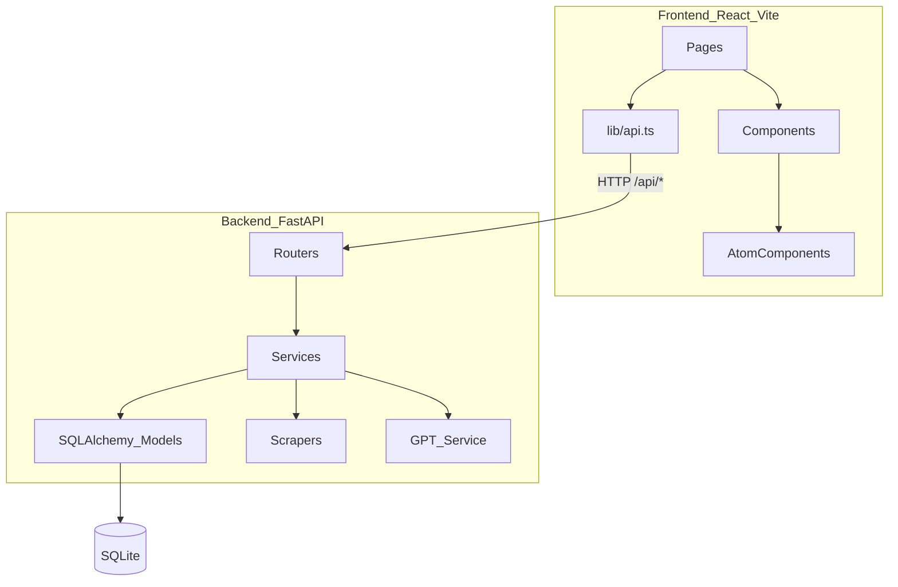

# Architecture Overview

このドキュメントは `English-net-dict` の全体構成とデータフローを初心者向けにまとめたものです。

## High-Level

## Directory Roles

- `frontend/src/pages`: 画面単位のコンテナ。データ取得とUI組み立てを担当
- `frontend/src/components`: 再利用コンポーネント（表示ロジック）
- `frontend/src/components/atom`: 最小単位のUI部品
- `frontend/src/lib`: APIクライアント・共通フック・共通定数
- `backend/app/routers`: HTTP入出力とバリデーション
- `backend/app/services`: ドメインロジック・外部連携・データ変換
- `backend/app/models.py`: DBスキーマ（SQLAlchemy）
- `backend/alembic`: DBマイグレーション（版管理）

## Main Flows

### 1) 単語登録

1. フロントから `POST /api/words`
2. ルーターがサービス呼び出し
3. サービスがスクレイプ・構造化・補完を実行
4. モデル経由でSQLiteへ保存
5. フロントが再取得して表示更新

### 2) 単語詳細表示

1. フロントが `GET /api/words/{id}` または `GET /api/words/by-text/{word}`
2. バックエンドで関連テーブルをロード
3. `WordRead` 形式で返却
4. フロントで意味・語源・派生語・関連語・画像・チャットを描画

### 3) チャット

1. セッション作成（単語/語源要素/グループ）
2. メッセージ送信
3. バックエンドで応答生成し `chat_messages` に保存
4. フロントはポーリングではなくクエリ無効化で再取得
