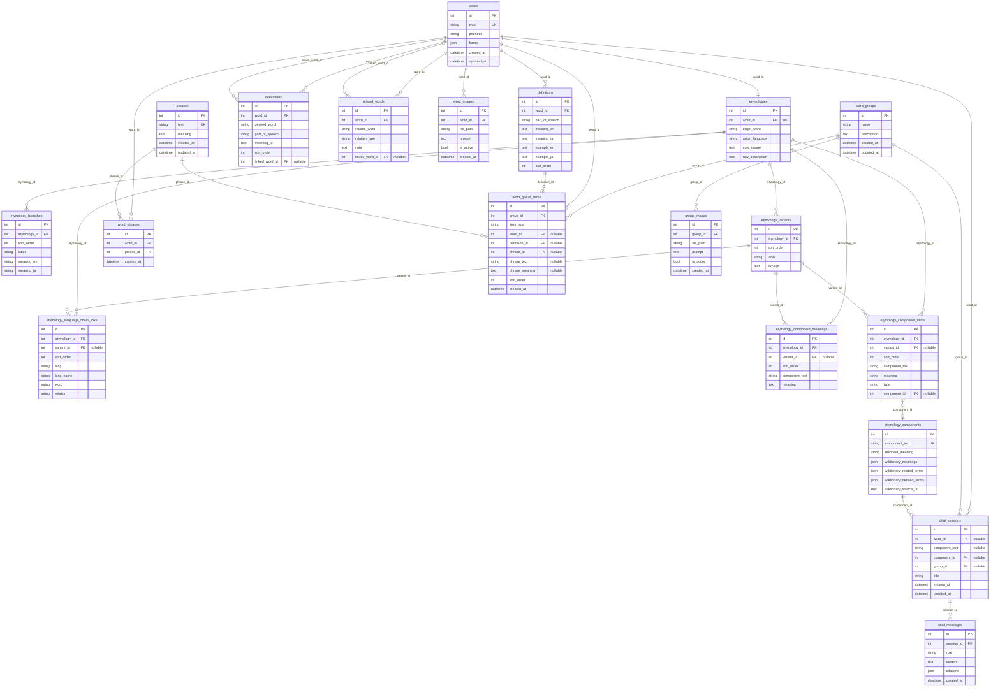

# データベース（単語周り）

単語データは SQLite で保存され、`words` を中心に定義・語源・派生語・関連語・画像・チャットがリレーションしています。ORM は SQLAlchemy（[backend/app/models.py](../backend/app/models.py)）。

---

## テーブル一覧

| テーブル | 役割 | 主なカラム |
|----------|------|------------|
| **words** | 単語本体 | `id`, `word`(unique), `phonetic`, `forms`(JSON), `created_at`, `updated_at` |
| **definitions** | 定義（意味・例文） | `id`, `word_id`, `part_of_speech`, `meaning_en`, `meaning_ja`, `example_en`, `example_ja`, `sort_order` |
| **etymologies** | 語源（1単語1件） | `id`, `word_id`(unique), `origin_word`, `origin_language`, `core_image`, `raw_description` |
| **etymology_branches** | 語源の意味分岐 | `id`, `etymology_id`, `sort_order`, `label`, `meaning_en`, `meaning_ja` |
| **etymology_variants** | 語源バリエーション | `id`, `etymology_id`, `sort_order`, `label`, `excerpt` |
| **etymology_language_chain_links** | 言語チェーン（トップ or バリアント内） | `id`, `etymology_id`, `variant_id`(nullable), `sort_order`, `lang`, `lang_name`, `word`, `relation` |
| **etymology_component_meanings** | コンポーネント意味（トップ or バリアント内） | `id`, `etymology_id`, `variant_id`(nullable), `sort_order`, `component_text`, `meaning` |
| **etymology_component_items** | 語源パーツ（トップ or バリアント内） | `id`, `etymology_id`, `variant_id`(nullable), `sort_order`, `component_text`, `meaning`, `type`, `component_id`(nullable) |
| **derivations** | 派生語 | `id`, `word_id`, `derived_word`, `part_of_speech`, `meaning_ja`, `sort_order`, `linked_word_id`（別単語へのリンク） |
| **related_words** | 関連語 | `id`, `word_id`, `related_word`, `relation_type`, `note`, `linked_word_id`（別単語へのリンク） |
| **phrases** | 熟語・慣用句（正規化テキスト一意） | `id`, `text`(unique), `meaning`, `created_at`, `updated_at` |
| **word_phrases** | 単語と熟語の多対多 | `id`, `word_id`, `phrase_id`, `created_at`（`word_id`+`phrase_id` で一意） |
| **word_groups** | 単語グループ | `id`, `name`, `description`, `created_at`, `updated_at` |
| **word_group_items** | グループ内アイテム（単語 / 定義 / 熟語） | `id`, `group_id`, `item_type`, `word_id`, `definition_id`, `phrase_id`, `phrase_text` / `phrase_meaning`（レガシー表示用）, `sort_order` |
| **group_images** | グループ画像 | `id`, `group_id`, `file_path`, `prompt`, `is_active`, `created_at` |
| **word_images** | 単語画像 | `id`, `word_id`, `file_path`, `prompt`, `is_active`, `created_at` |
| **etymology_components** | 語源コンポーネントのキャッシュ（単語と直接のFKなし） | `id`, `component_text`(unique), `resolved_meaning`, `wiktionary_meanings`(JSON), `wiktionary_related_terms`, `wiktionary_derived_terms`, `wiktionary_source_url` |
| **chat_sessions** | チャットセッション（単語 or 語源コンポーネント紐づき） | `id`, `word_id`(nullable), `component_text`(nullable), `component_id`(nullable), `title`, `created_at`, `updated_at` |
| **chat_messages** | チャットメッセージ | `id`, `session_id`, `role`, `content`, `citations`(JSON), `created_at` |

---

## words.forms(JSON) の内部構造

`words.forms` は活用情報と成句情報を保持する JSON オブジェクトです。

- `third_person_singular`: 三単現（例: `"goes"`）
- `present_participle`: 現在分詞（例: `"going"`）
- `past_tense`: 過去形（例: `"went"`）
- `past_participle`: 過去分詞（例: `"gone"`）
- `plural`: 複数形（例: `"books"`）
- `comparative`: 比較級（例: `"faster"`）
- `superlative`: 最上級（例: `"fastest"`）
- `uncountable`: 不可算フラグ（例: `true`）

**熟語（phrases）**は `words.forms` には保持しません。正規データは **`phrases` テーブル**と **`word_phrases`** で管理します。アプリ起動時の `runtime_sqlite` が、過去に `forms.phrases` に入っていた JSON を **`phrases` / `word_phrases` に移行したうえで JSON から `phrases` キーを除去**します（意味が複数ある場合は全角カンマ `，` で連結して 1 行にマージ）。

レガシー互換として、API 応答や一部コードは **旧キー `phrase`（テキスト）** を **新フィールド `text`** に読み替えています。

---

## リレーション

- **words → definitions**: 1:N。`definitions.word_id` → `words.id`。ON DELETE CASCADE。
- **words → etymologies**: 1:1。`etymologies.word_id` → `words.id`（unique）。ON DELETE CASCADE。
- **etymologies → etymology_branches**: 1:N。`etymology_branches.etymology_id` → `etymologies.id`。CASCADE。
- **etymologies → etymology_variants**: 1:N。`etymology_variants.etymology_id` → `etymologies.id`。CASCADE。
- **etymologies → etymology_language_chain_links**: 1:N。`variant_id` が NULL のときトップレベル、非 NULL のときバリアント内。
- **etymologies → etymology_component_meanings**: 1:N。同上。
- **etymologies → etymology_component_items**: 1:N。`variant_id` が NULL のときトップレベル、非 NULL のときバリアント内。CASCADE。
- **etymology_variants → etymology_component_items**: 1:N。`etymology_component_items.variant_id` → `etymology_variants.id`。CASCADE。
- **etymology_components → etymology_component_items**: 1:N。`etymology_component_items.component_id` → `etymology_components.id`（nullable, ON DELETE SET NULL）。
- **words → derivations**: 1:N。`derivations.word_id` → `words.id`。CASCADE。
  `derivations.linked_word_id` → `words.id` で派生先単語を参照（ON DELETE SET NULL）。
- **words → related_words**: 1:N。`related_words.word_id` → `words.id`。CASCADE。
  `related_words.linked_word_id` → `words.id` で関連単語を参照（ON DELETE SET NULL）。
- **words ↔ phrases**: 多対多。`word_phrases.word_id` → `words.id`、`word_phrases.phrase_id` → `phrases.id`。両方 CASCADE。並び順カラムはなし。
- **phrases → word_group_items**: 1:N。`word_group_items.phrase_id` → `phrases.id`（ON DELETE SET NULL）。表示は `phrase_ref` を優先し、未設定時は `phrase_text` / `phrase_meaning` にフォールバック。
- **word_groups → word_group_items**: 1:N。`word_group_items.group_id` → `word_groups.id`。CASCADE。
- **word_groups → group_images**: 1:N。`group_images.group_id` → `word_groups.id`。CASCADE。
- **words → word_images**: 1:N。`word_images.word_id` → `words.id`。CASCADE。
- **words → chat_sessions**: 1:N。`chat_sessions.word_id` → `words.id`（nullable）。CASCADE。語源コンポーネント用のセッションは `word_id` が NULL で `component_text` / `component_id` を使用。
- **etymology_components → chat_sessions**: 1:N。`chat_sessions.component_id` → `etymology_components.id`（nullable, ON DELETE SET NULL）。
- **chat_sessions → chat_messages**: 1:N。`chat_messages.session_id` → `chat_sessions.id`。CASCADE。
- **chat_sessions 制約**: CHECK で「単語セッション（`word_id`）か、コンポーネントセッション（`component_text` / `component_id`）か、**グループセッション（`group_id`）**」のいずれかに限定。

---

## データベース関係図（Mermaid）



---

## 語源 JSON 列の正規化

従来 `etymologies` に JSON 列（`branches`, `language_chain`, `component_meanings`, `etymology_variants`）で保持していたデータは、正規化テーブル（`etymology_branches`, `etymology_variants`, `etymology_language_chain_links`, `etymology_component_meanings`）に移行済み。

既存 DB を移行する場合は、一時スクリプト `patch_normalize_etymology_json` を実行する:

```bash
cd backend
uv run python -m app.scripts.patch_normalize_etymology_json [--dry-run] [--limit N] [--word WORD]
```

実行前に DB バックアップを取ること。実行後、アプリを再起動すると `runtime_sqlite` が `etymologies` テーブルを再作成して JSON 列を除去する。

---

## 補足

- 画像ファイルは DB の `word_images.file_path` で参照され、実際のファイルはアプリの設定（`image_dir`）で指定したディレクトリに保存されます。
- 単語削除時、定義・語源・派生語・関連語・画像・その単語に紐づくチャットセッションは CASCADE で削除されます。チャットメッセージはセッション削除に連動して削除されます。

---

## Data Storage After Consolidation

All runtime data is consolidated under the project-root data/ directory.

- SQLite DB: data/db/data.db
- Word images: data/images/
- NLTK data: data/nltk_data/

The backend mounts /static to data/, so image URLs remain /static/images/{filename}.

## Legacy Layout Note

This repository now uses only the consolidated `data/` layout. Legacy paths
(`backend/data.db`, `backend/app/static/images/`, `backend/.nltk_data/`) are
not used by current runtime code.

New records store word_images.file_path as images/<filename>.png. Existing absolute-path rows still render as long as the files exist in data/images/, because the frontend builds URLs from the filename segment.
